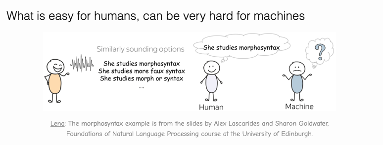
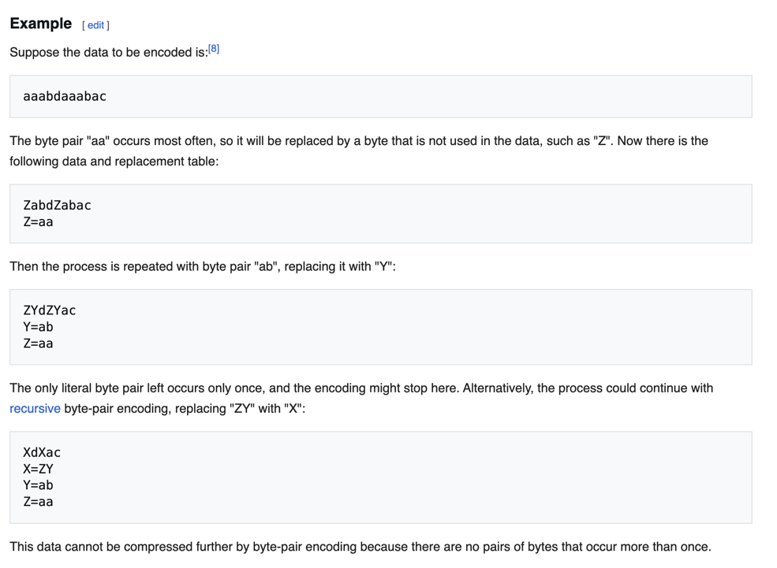

What is Language Modeling?

Language modeling is the process of a machine learning model learning to predict the next word in a sequence of text, based on the words that came before it.

We, humans, already have some feeling of "probability" when it comes to natural language. For example, when we talk, usually we understand each other quite well (at least, what's being said). We disambiguate between different options which sound similar without even realizing it!

But how a machine is supposed to understand this? A machine needs a language model, which estimates the probabilities of sentences. If a language model is good, it will assign a larger probability to a correct option.

Examples of language models include GPT-4, BERT, and Llama 3.

GPT{Generative Pretrained Transformer}

the core stages that a model like GPT (Generative Pre-trained Transformer) goes through are

📘 RAW TEXT DATA
      │
      ▼
🧹 1. DATA PREPROCESSING
   - Collect large text corpora (books, web, etc.)
   - Clean, normalize, remove duplicates
      │
      ▼
🔡 2. TOKENIZATION
   - Split text into subword tokens (e.g., BPE)
   - Convert words → numeric IDs
      │
      ▼
🧭 3. EMBEDDING LAYER
   - Token embeddings → represent meaning
   - Positional embeddings → represent order
      │
      ▼
🔁 4. TRANSFORMER BLOCKS (repeated N times)
   ├── Self-Attention (context across tokens)
   ├── Feed-Forward Network (nonlinear mapping)
   ├── Residual Connections + Layer Norm
      │
      ▼
🎯 5. OUTPUT HEAD
   - Linear projection to vocabulary size
   - Softmax → next-token probability
      │
      ▼
📉 6. TRAINING OBJECTIVE
   - Causal Language Modeling (predict next token)
   - Loss = Cross-Entropy between predicted vs actual token
      │
      ▼
⚙️ 7. OPTIMIZATION
   - Optimizer: AdamW
   - Learning rate schedule + gradient clipping
      │
      ▼
💪 8. PRETRAINED MODEL
   - Learns general language patterns
      │
      ▼
🎓 9. FINE-TUNING (optional)
   - Train on specific tasks (e.g., book verdicts)
   - Supervised fine-tuning or RLHF
      │
      ▼
💬 10. INFERENCE
   - Input prompt → model predicts next tokens
   - Generates text autoregressively

COLLECTING DATA

Now I am taking the data as the book "The Verdict"

Taking data from kaggle

---------------------------------------------------------------------------------------------------------

TOKENIZATION

Tokenization is the process of replacing sensitive data with a non-sensitive, unique equivalent called a "token"

Good tokenization web app :https://tiktokenizer.vercel.app

Byte pair encoder

Byte Pair Encoding (BPE) is a data compression and tokenization technique that repeatedly merges the most frequent pair of adjacent symbols (bytes or characters) into a single, new symbol

______________________________________________________________________________________________________________________________________________________________________________________________________

EMBEDDING LAYER

"""
Word Embeddings

(〜￣▽￣)〜

Word Embeddings is “a popular and powerful way
to associate a vector with a word” 🚀

An excellent benefit to using Word Embeddings is that
it can “pack more information into far FEWER dimensions” than
the “word vectors obtained via One-Hot encoding”

I like the following remark about Word Embeddings 😉
from https://medium.com/aiguys/word-embeddings-cbow-and-skip-gram-5d615ad61d3d
“Word embeddings can be thought of as an alternate to one-hot encoding
along with dimensionality reduction.”

